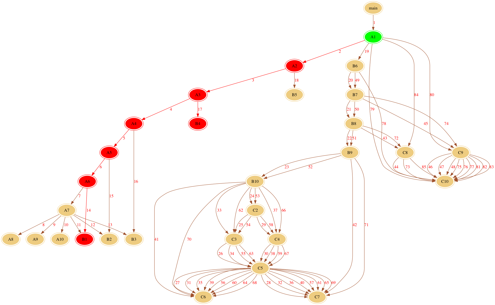

# 利用 AspectJ 追踪程序调用序列

## Requirements

- Mac OSX 10.12 (16A323)
- JDK 1.7.0_79
- Maven 3.3.9
- Graphviz 2.38.0_1

## How to run

1. 安装好上述环境
2. 打开idea导入项目, 安装好maven所需要的包
3. 运行 `src/main/java/aspectj/trace/ui/MainForm.java` 即可运行UI界面
4. 选择 `demo/SimpleApp.java` 作为输入的编译文件, 点击生成调用序列即可得到该文件的函数调用序列
5. 选择匹配序列, 并且选择 `demo/match*.txt` 作为匹配序列输入文件, 点击搜索匹配序列即可得到匹配的调用序列以及可视化图形, 具体效果见下面。

## 界面


## 原始图


## 匹配序列


## Dot 语言常用命令
```
# 生成图形
dot -Tpng x.dot -o x.png
```